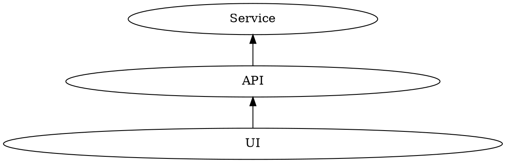

## Testování

### Testovací pyramida

Testovací pyramida je návod, jak postupovat při plánování a vytváření testů.
Vertikální osa vyznačuje úroveň abstrakce, horizontální osa množství testů.
Jak se pohybujeme směrem vzhůru, klesá počet testů, zato však stoupá úroveň jejich abstrakce.

### Druhy testů

#### Blackbox testování

!TODO!

#### Whitebox testování

!TODO!

#### Jednotkové testy (unit testing)

!TODO!

#### Komponentové testy (component testing)

!TODO!

#### Integrační testy (integration testing)

!TODO!

#### Bezpečnostní testy (security testing)

!TODO!

#### Funkční testy (functional testing)

!TODO!

#### Jednotkové testy (acceptance testing)

!TODO!

### Reference

- https://technologyconversations.com/2013/12/11/black-box-vs-white-box-testing/
- http://blog.stevensanderson.com/2009/08/24/writing-great-unit-tests-best-and-worst-practises/
