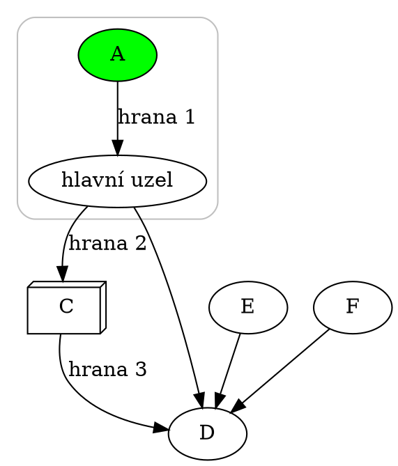
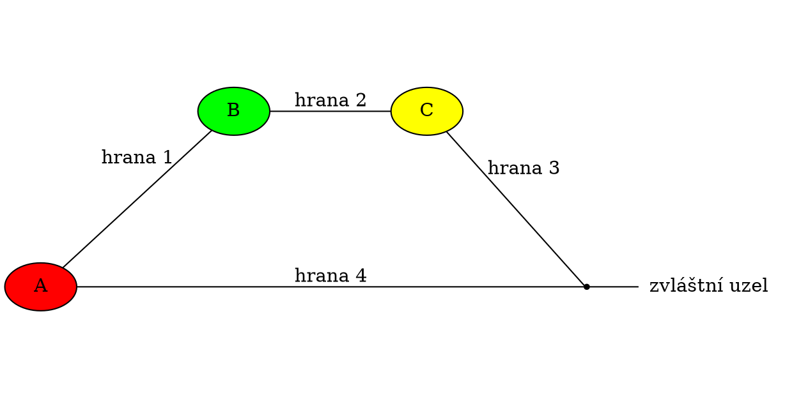
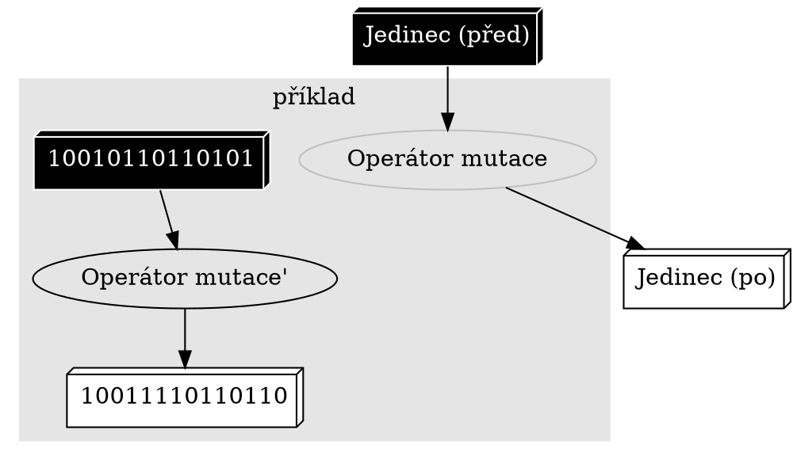
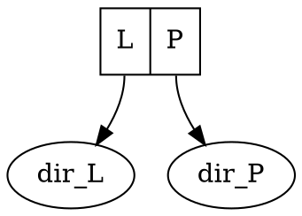

## Graphviz

Graphviz je sada nástrojů pro vykreslování grafů (dot, neato, fdp, sfdp, twopi, circo). Graf se zapíše pomocí speciálního skriptovacího jazyka a zvolený nástroj vhodně rozmístí jeho uzly, hrany, a vykreslí jej do zvoleného formátu. S trochou cviku lze pomocí Graphvizu kreslit i různé diagramy, sítě a schémata.
Největší výhodou tohoto nástroje je, že člověk se nemusí tolik zabývat vzhledem grafu, pouze jeho strukturou.
Na podobném principu funguje i nástroj pro kreslení UML schémat [PlantUML](wiki/plant-uml).

Vykreslení grafu do souboru PNG:

```bash
dot -Tpng VSTUP.dot > VÝSTUP.png
```

### Syntaxe v příkladech

#### Orientovaný graf



```dot:digraph
rankdir = LR;
A -> B [label = "hrana 1"];
B -> C [label = "hrana 2"];
C -> D [label = "hrana 3"];
B -> D;
E -> D;
F -> D;
A [style = filled, fillcolor = green];
B [label = "hlavní uzel"];
C [shape = box3d];

subgraph clusterAB
{
  A; B;
  style = rounded;
  color = gray;
}
```

#### Neorientovaný graf



```dot:graph
rankdir = LR;
ratio = 0.5;
A -- B [label = "hrana 1"];
B -- C [label = "hrana 2"];
C -- D [label = "hrana 3"];
D -- A [label = "hrana 4"];
D -- E;
A [style = filled, fillcolor = red];
B [style = filled, fillcolor = green];
C [style = filled, fillcolor = yellow];
D [shape = point];
E [label = "zvláštní uzel", shape = plaintext];
```

#### Diagram



```dot:digraph
"Jedinec (před)" [shape = box3d, style = filled, fillcolor = black, color = white, fontcolor = white];
"Jedinec (po)" [shape = box3d, style = filled, fillcolor = white, color = black, fontcolor = black];
"Operátor mutace" [color = gray];
"Jedinec (před)" -> "Operátor mutace" -> "Jedinec (po)";

subgraph cluster0
{
  style = filled;
  color = gray90;
  label = "příklad";
  "10010110110101" [shape = box3d, style = filled, fillcolor = black, color = white, fontcolor = white];
  "10011110110110" [shape = box3d, style = filled, fillcolor = white, color = black, fontcolor = black];
  "Operátor mutace" [label = "Operátor mutace", color = gray];
  "10010110110101" -> "Operátor mutace'" -> "10011110110110";
}
```

### Hodnoty

#### Tvary uzlů

```dot
A [shape = box];
```

```dot:graph
ellipse [shape = ellipse];
circle [shape = circle];
doublecircle [shape = doublecircle];
point [shape = point];
egg [shape = egg];
diamond [shape = diamond];
```

```dot:graph
box [shape = box];
rect [shape = rect];
note [shape = note];
tab [shape = tab];
component [shape = component];
folder [shape = folder];
box3d [shape = box3d];
record [shape = record, label = "record|shape"];
plaintext [shape = plaintext];
```

box, ellipse, circle, point, egg, plaintext, diamond, doublecircle, rect, note, tab, component, folder, box3d, record

#### Tvar "record"



```dot:digraph
A [shape = record, label = "<l> L|<p> P"];
A:l -> dir_L;
A:p -> dir_P;
```

#### Tvary šipek

```dot
A -> B [arrowhead = vee];
A -> B [arrowtail = vee];
A -> B [arrowsize = 1.5];
```

normal, inv, dot, invdot, odot, invodot, none, tee, empty, invempty, diamond, odiamond, ediamond, crow, box, obox, open, halfopen, vee

#### Směr šipek

```dot
A -> B [dir = forward];
```

forward, back, both, none

### Reference

- http://www.graphviz.org/doc/
- http://www.graphviz.org/doc/info/attrs.html